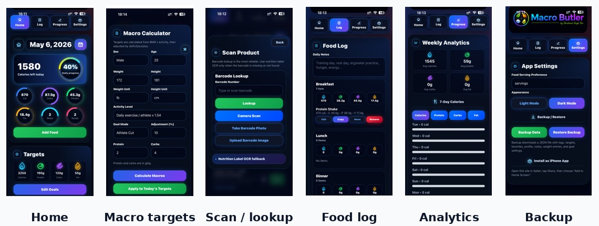

<div align="center">

# Macro Butler

### Mobile-first macro tracking PWA for meal logging, barcode lookup, OCR label scanning, goals, analytics, and backup/restore

JavaScript · PWA · OCR · Barcode Scanning · Nutrition Tracking · Mobile Web

</div>

---

<p align="center">
  
</p>

## Overview

Macro Butler is a mobile-first nutrition tracking web app built as a Progressive Web App. It supports daily macro tracking, meal logging, saved foods, custom recipes, barcode lookup, OCR nutrition-label scanning, goal setting, progress analytics, and backup/restore.

This project was built as a personal productivity and health-tracking tool, with emphasis on a fast phone-first workflow and a polished mobile UI.

---

## What This Project Demonstrates

| Area | Evidence |
|---|---|
| **Mobile-first web app design** | Single-page app optimized around phone screens and daily use |
| **Progressive Web App setup** | Manifest, app icons, standalone display mode, and service-worker caching |
| **Barcode scanning** | ZXing browser integration for product barcode lookup workflows |
| **OCR label scanning** | Tesseract.js integration for nutrition-label fallback scanning |
| **Nutrition database design** | Local JSON datasets for common foods, branded foods, restaurant foods, ingredients, recipes, serving units, and categories |
| **User workflow design** | Home dashboard, target editing, meal logging, scan screen, analytics, and backup/restore |
| **Frontend implementation** | HTML, CSS, JavaScript, local browser storage, responsive UI states, and offline-friendly behavior |

---

## App Screens

| Screen | Purpose |
|---|---|
| **Home** | Daily calorie and macro dashboard with progress rings |
| **Macro targets** | Edit age, height, weight, activity level, goal mode, and target macros |
| **Scan / lookup** | Barcode lookup, camera scan, photo upload, and OCR label fallback |
| **Food log** | Meal-based logging for breakfast, lunch, dinner, snacks, and training-day notes |
| **Analytics** | Weekly macro and calorie trends |
| **Settings / backup** | Light/dark mode, backup export, restore, and install guidance |

---

## Features

- Daily calorie and macro tracking
- Protein, carbohydrate, fat, and calorie goals
- Meal logging by food item and serving size
- Saved foods and custom recipes
- Barcode scanning for packaged foods
- OCR label scanning for nutrition labels
- Food database search
- Progress analytics
- Light/dark visual modes
- Backup and restore support
- PWA installation support
- Offline-friendly service-worker caching

---

## Technical Highlights

Core technologies:

```text
HTML
CSS
JavaScript
Progressive Web App manifest
Service worker
Tesseract.js
ZXing Browser
JSON food datasets
Local browser storage
```

---

## Repository Structure

```text
macro-app/
├── index.html
├── manifest.json
├── service-worker.js
├── core_foods.json
├── brand_foods.json
├── restaurant_foods.json
├── ingredients_foods.json
├── custom_recipes.json
├── serving_units.json
├── food_categories.json
├── icon.PNG
├── macro-butler-logo.svg
└── images/
    └── screenshots/
        ├── macro-butler-screenshot-strip.jpg
        ├── home.png
        ├── edit-macros.png
        ├── scan.png
        ├── food-log.png
        ├── analytics.png
        └── settings-backup.png
```

---

## Run Locally

Because this is a static web app, it can be opened directly in a browser. For the best behavior with service-worker and PWA features, run it through a local server:

```bash
python -m http.server 8000
```

Then open:

```text
http://localhost:8000
```

---

## Data Notes

The app includes local food datasets for common foods, branded foods, restaurant foods, ingredients, recipes, serving units, and categories.

Nutrition values should be treated as practical app data rather than medical or clinical nutrition guidance. Users should verify food data for strict dietary, medical, or competition-prep use.

---

## Portfolio Scope

This is a personal software side project. It is included in my portfolio to show frontend implementation, mobile UX thinking, browser APIs, OCR/barcode integration, local data modeling, and practical app design.

My primary engineering portfolio focus remains robotics, embedded sensing, EV systems, validation, and mechatronics.
